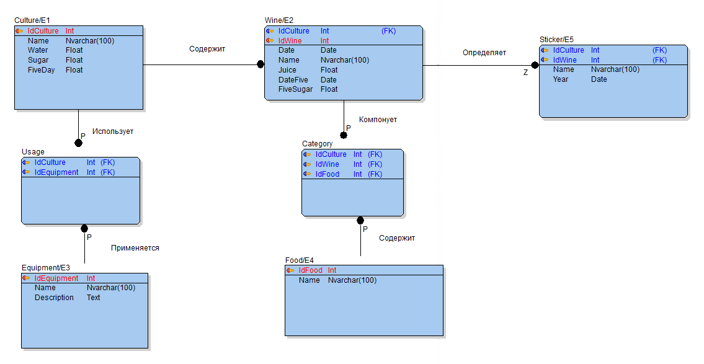
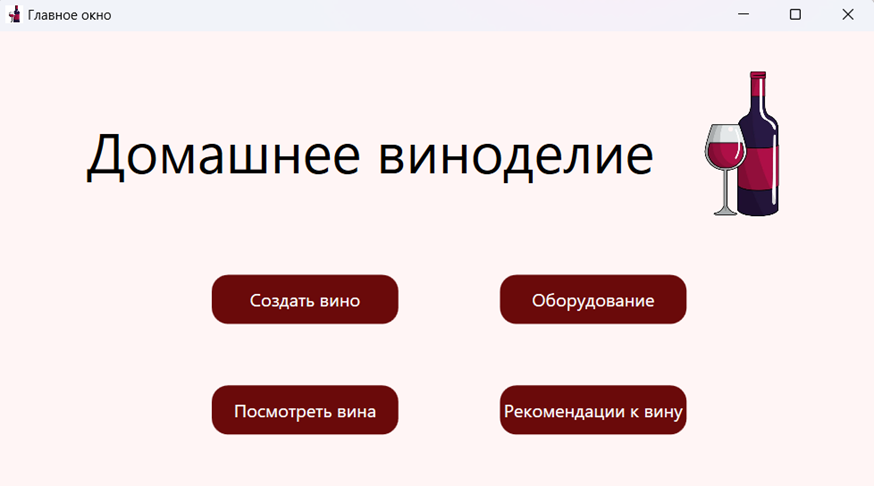
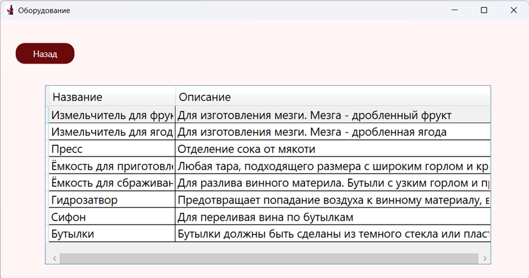
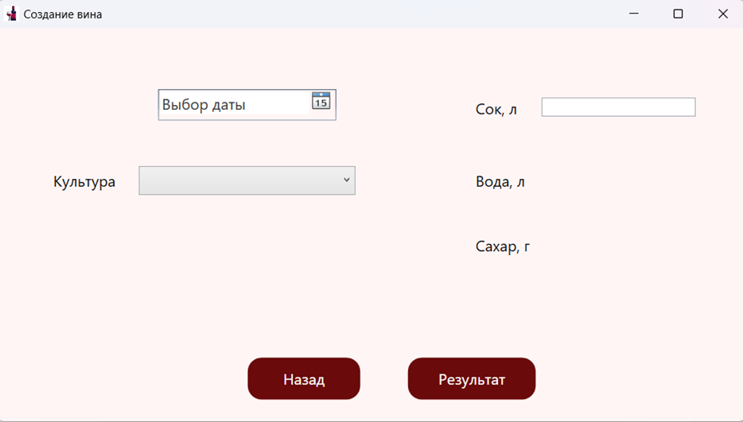
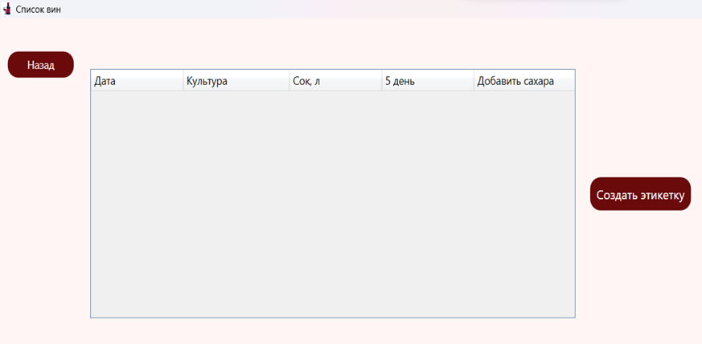
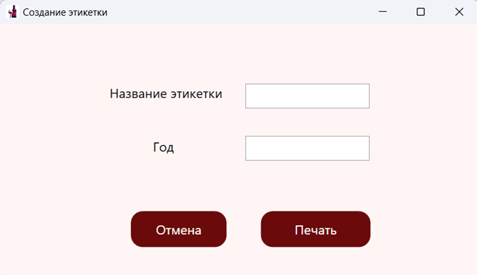
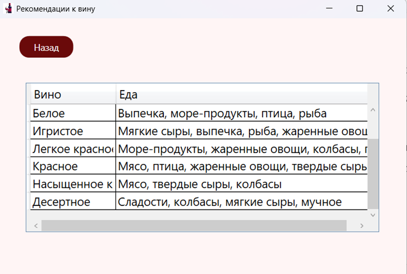

# Цель приложения

Создание приложения, которое будет способствовать упрощению и автоматизации процессов, связанных с изготовлением домашнего вина.

# База данных

# Приложение

При запуске приложения пользователь видит перед собой главное окно приложения, в котором он может нажать на одну из четырёх кнопок.

В этом окне можно будет создать новое вино, посмотреть созданные вина, оборудование для изготовления и рекомендации к вину.
В окне «Оборудования» есть возможность посмотреть назначение оборудования для конкретного процесса изготовления.
 

В окне создания вина пользователь вводит данные: количество литров, вид культуры и дату. После чего будет известно сколько нужно будет добавить сахара и воды в сок. 

В окне «Список вин» будет предоставлена информация о созданных винах, которая содержит дату добавления сахара и воды, культуру, количество сока и сколько нужно добавить сахара после пяти дней.

Окно просмотра созданных вин также позволяет пользователю создать этикетку для данного вина, переходя в другое окно.

Данное окно предоставляет возможность изменить данные этикетки и распечатать её.
В окне рекомендации к вину можно посмотреть продукты питания, которые будут хорошо сочетаться с конкретным видом вина.

# Используемые технологии
Microsoft SQL Server, Toad Data Modeler, Visual Studio